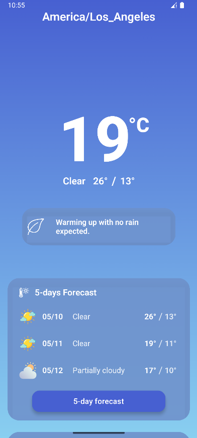
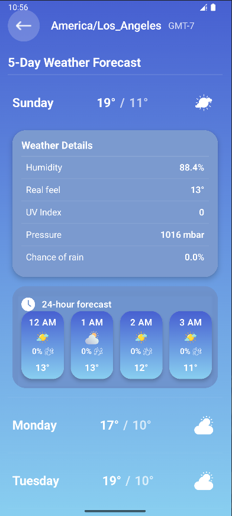

# Weather App

A clean, modern weather application built with pure Android SDK components.

## Features

- Current weather conditions with temperature display
- 5-day weather forecast with detailed daily information
- 24-hour forecast with hourly predictions
- Location-based weather data
- Pull-to-refresh functionality for latest updates
- Offline support with cached weather data
- Smooth animations and transitions
- Modern UI with consistent color theming

## Screenshots

  
  

## Technical Details

This project demonstrates building a weather application using only the Android core SDK:

- No third-party libraries (no Retrofit, Volley, Coroutines, Room, etc.)
- Uses ThreadExecutor instead of Coroutines
- Uses HttpURLConnection instead of Ktor
- Implements state saving with Parcelable instead of ViewModel
- Uses SharedPreferences for data caching instead of Room
- Uses LocationManager instead of FusedLocationProviderClient
- Uses org.json for parsing instead of GSON or Moshi
- Clean architecture with separation of concerns
- Responsive UI built with Jetpack Compose

## Implementation Choices

### Core SDK Approach

As specified in the requirements, this application avoids third-party libraries by using:

- **ThreadExecutor** instead of Coroutines for background operations
- **HttpURLConnection** instead of Retrofit/Ktor for network requests
- **onSaveInstanceState with Parcelable** instead of ViewModel for state preservation
- **SharedPreferences** rather than Room for data persistence (storing JSON strings)
- **LocationManager** rather than FusedLocationProviderClient for location services
- **org.json** rather than GSON/Moshi for JSON parsing

### Architecture

The application follows clean architecture principles with three distinct layers:

1. **Data Layer**

   - DTOs (Data Transfer Objects) for API responses
   - Repository implementation
   - Local and remote data sources

2. **Domain Layer**

   - Business models
   - Repository interfaces

3. **Presentation Layer**
   - UI models with Parcelable implementation
   - Controllers for business logic
   - Compose UI components

### Key Features

- Current weather display with detailed information
- 5-day weather forecast
- Pull-to-refresh functionality
- Offline support with cached data
- Error handling for network issues
- Configuration change handling (screen rotation)
- Location-based weather information

### Design Patterns

- **Repository Pattern**: Abstracts data sources from the rest of the application
- **Mapper Pattern**: Converts between different model types
- **Dependency Injection**: Manual DI through AppContainer
- **Observer Pattern**: Custom callbacks for asynchronous operations

## Project Structure

- **data**: DTOs, repository implementations, data sources
- **domain**: Business models, repository interfaces
- **presentation**: UI models, controllers, Compose UI
- **utils**: Helper classes and utilities

## Setup Instructions

1. Create a `local.properties` file in the project root
2. Add your Visual Crossing Weather API key: `API_KEY="your_api_key_here"`
3. Build and run the application

## Requirements

- Android SDK 28+
- [Visual Crossing Weather](https://www.visualcrossing.com/) API key
